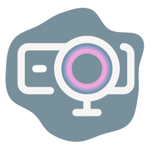
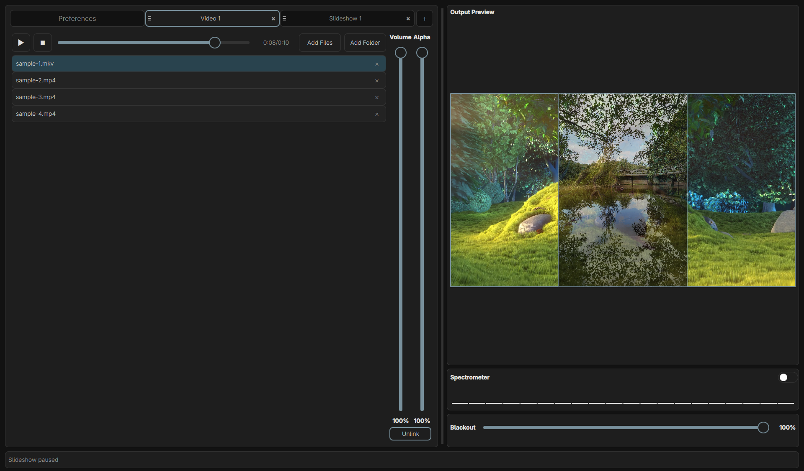
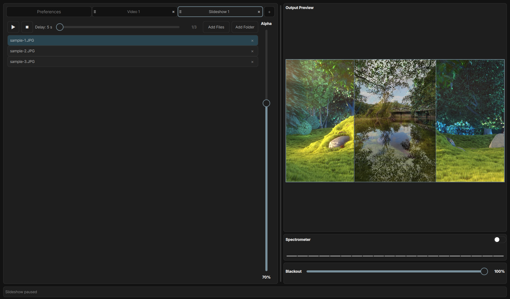
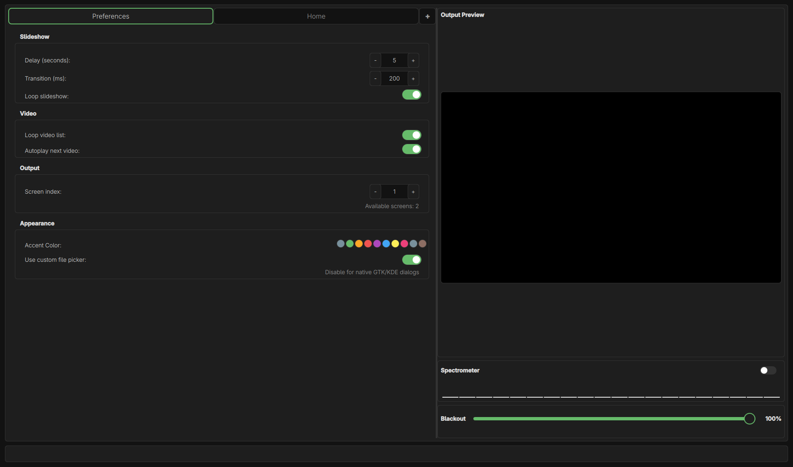

<p align="center">

</p>
<h1 align="center">Lumixor</h3>
<h3 align="center">An open-source VJ app</h3>
<br/>

This project attempts to fill the gap of a simple VJ (Video-Jockey) controller that runs smoothly on small systems (i.e. Raspberry Pi) and covers basic features such as
- video playback
- slideshow of images
- blackout and crossfade functionality
- multi screen with preview in control window

## Installation

### AppImage (Recommended)

Download the latest AppImage from the [Releases](https://github.com/yourusername/lumixor/releases) page.

For video playback support, you may need to install Qt5 multimedia plugins:
```bash
# Ubuntu/Debian
sudo apt-get install qtmultimedia5-dev gstreamer1.0-plugins-good gstreamer1.0-plugins-bad gstreamer1.0-libav

# Fedora
sudo dnf install qt5-qtmultimedia gstreamer1-plugins-good gstreamer1-plugins-bad-free

# Arch
sudo pacman -S qt5-multimedia gst-plugins-good gst-plugins-bad gst-libav
```

### Building from Source

You can easily build the application yourself by
1. Installing the required dependencies
```
./install-build-dependencies.sh
```
2. Building the application
```
./build.sh
```
3. The output is then in `./build/lumixor-qt`

## Usage

On startup, two windows will open. One is the so called "Output Window", the other is the "Control Window".
In the control window, the program shows the main tab. Here you can add media either by selecting individual files or complete folders.
The selected images or videos are then sorted into separate tabs from where you can start the playback of slideshows or videos respectively.
Each tab has an alpha slider, controlling the transparency of the media.
You can add more media (slideshows/ videos) by clicking on the "+" at the right hand side of the tab bar.
Note that the media is rendered in the order of the tabs from left to right (i.e. the rightmost tab will be rendered on top of the others).
You can get a preview in the right panel, where you can also find a blackout slider that allows you to darken the output in the second window.

## Screenshots

Following screenshots show the control window only.
The content of the output window is identical to what you can see in the preview on the right.

|                             Video                              |
| :------------------------------------------------------------: |
|  |

|                           Slideshow                            |
| :------------------------------------------------------------: |
|  |

|                          Preferences                           |
| :------------------------------------------------------------: |
|  |

## Known Bugs and Limitations

- video briefly lags when slideshow image changes
- no webm support
- layout is not responsive
- no support for OS != Linux atm.

## Related Software

### Open Source

- **OBS Studio** – Closest comparison. Scene-based compositor for streaming/recording. No live crossfade, beat-sync, or real-time layer blending. Designed for broadcasters, not live performers.
- **VLC** – Powerful media player with broad codec support. Single-stream playback only; no multi-layer mixing, crossfade, or output separation.
- **OpenStageControl** – OSC/MIDI control surface builder. Not a video mixer; could complement Lumixor as a custom controller UI.
- **Hydra** – Browser-based live-coding visuals. Generative only; no file-based media playback or traditional GUI.
- **Processing / openFrameworks** – Creative coding frameworks. Require programming to build visuals; not ready-to-use VJ applications.
- **xjadeo** – Video player synced to external timecode (LTC/MTC). Playback only; no mixing, effects, or multi-source support.
- **ffplay / mpv** – Lightweight CLI players. No GUI, no layer compositing, no live control.

### Commercial (for reference)

- **Resolume** – Industry-standard VJ software with effects, MIDI, projection mapping. Closed-source, expensive, heavy resource usage.
- **VDMX** – Powerful but macOS-only and proprietary.
- **GrandVJ** – Similar to Resolume; closed-source, Windows/macOS only.

## Roadmap (prioritized)

1. Workspaces to quickly open up combinations of slideshows/ videos
2. Ambient light control (qlc+ connection via OSC)
3. MIDI & OSC control + learn mode; hotcues & cue lists.
4. Shader effects, blending modes, per-layer transforms.
5. **WIP** Audio analysis (beat detection / FFT) and audio-reactive parameters.
6. Timeline/cue automation + snapshot save/load.
7. Projection mapping tools and multi-output layout editor.
8. Better video backend (GStreamer/FFmpeg) & NDI / virtual output.

## Disclaimer

As my skills in the C++/QT-QML Language are quite limited, I heavily relied on LLM-assistance when creating this project.
Altough I'm trying to keep things as clean and structured as possible, expect some LLM typical artifacts of code generation. 